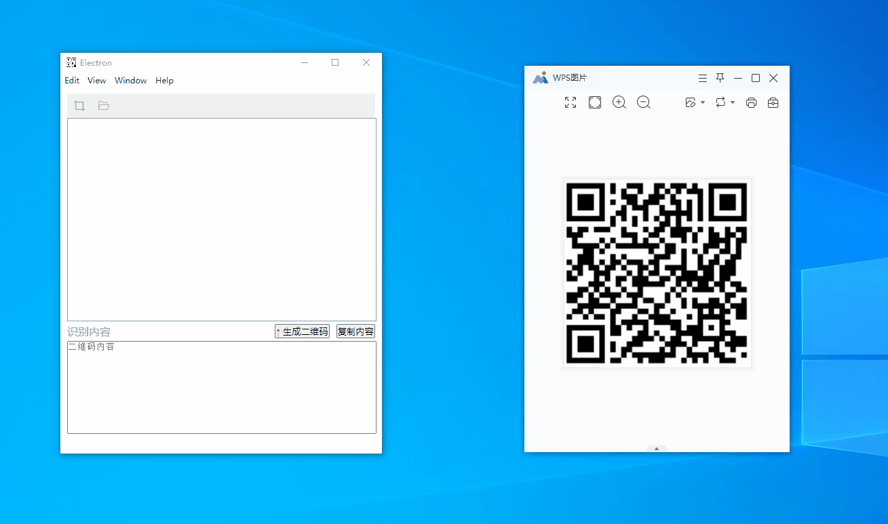
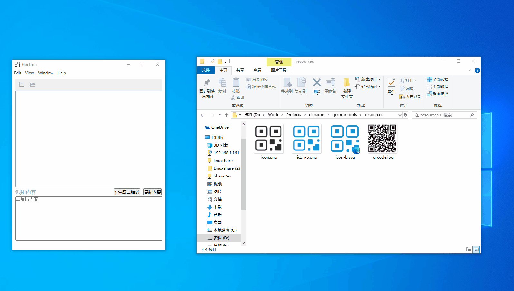
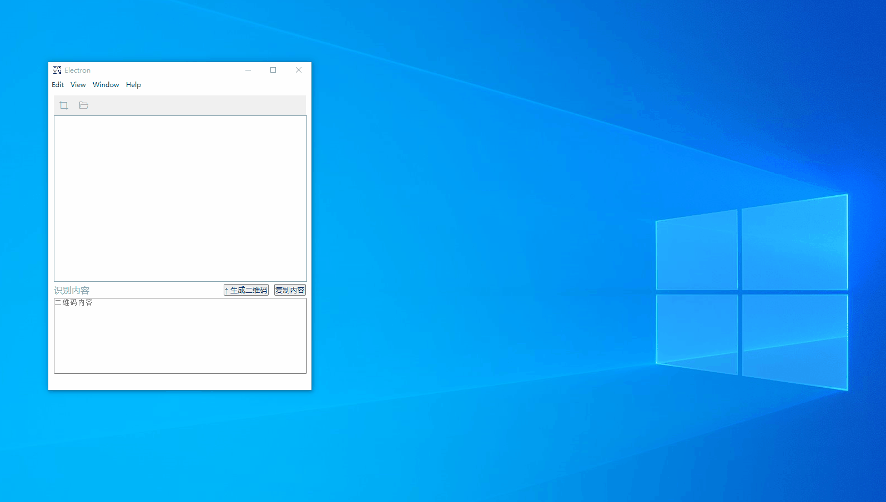
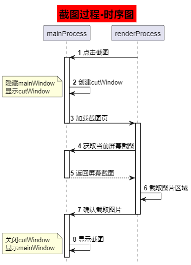

# qrcode-tools

English | [简体中文](./README_zh-CN.md)

Very suitable for newcomers to the Electron learning project , it is a simple and easy to use QR code recognition tool ( based on : Electron + Vue implementation ), although it is very small but basically encompasses the entire process of Electron project development .

## 🛠️ Recommended Configurations

- [VSCode](https://code.visualstudio.com/) + [ESLint](https://marketplace.visualstudio.com/items?itemName=dbaeumer.vscode-eslint) + [Prettier](https://marketplace.visualstudio.com/items?itemName=esbenp.prettier-vscode) + [Volar](https://marketplace.visualstudio.com/items?itemName=Vue.volar)

## 🖥️ Quick Start

### Install

```bash
$ yarn
```

### Development

```bash
$ yarn dev
```

### Build 

```bash
# For windows
$ yarn build:win

# For macOS
$ yarn build:mac

# For Linux
$ yarn build:linux
```

## ✨ Feature
- Screenshot to recognize the QR code
- Upload to recognize the QR code
- Generate QR code based on characters

## 🎯 Effect
- Screenshot to recognize the QR code
  

- Upload to recognize the QR code
  

- Generate QR code based on characters
  

## 📝 TODO
- [x] Support multi-screen capture
- [x] Support screenshot to recognize QR code
- [x] Generate QR codes based on content
- [x] Support uploading pictures to recognize QR code
- [x] Support for modifying shortcut key operations
- [x] Supports automatic detection of updates
- [x] Change icon

## 📸 Screenshot Realization Flow


## 📚 Instructions for use
- Shortcut key
  - Screenshot：Ctrl + Alt + C (Default Shortcut Keys)
  - Exit：Esc
- Finished screenshot: double mouse click

